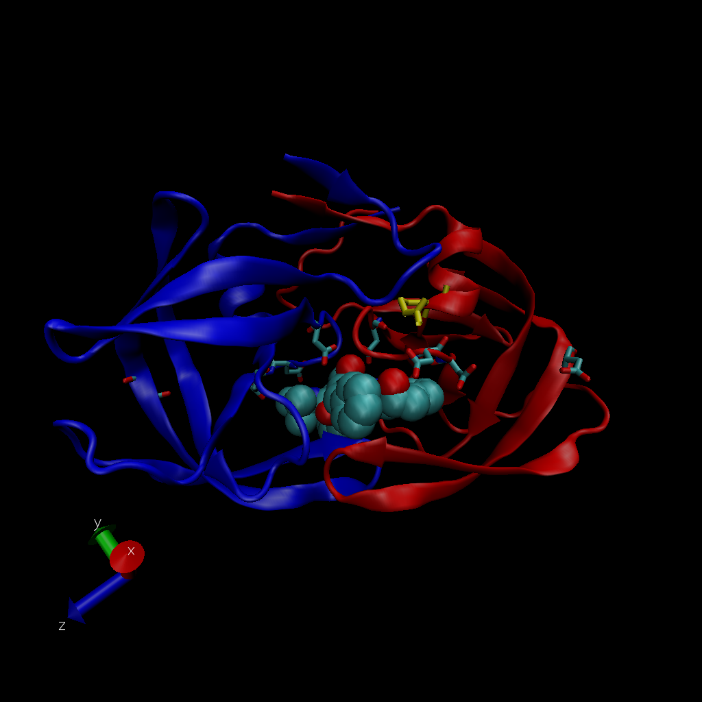

## Intro to PDB

```{r}
db <- read.csv("Data Export Summary.csv", row.names=1)
head(db)
```

> Q1: What percentage of structures in the PDB are solved by X-Ray and Electron Microscopy.

```{r}
round(sum(db$X.ray)/ sum(db$Total) * 100, 2)
round(sum(db$EM)/ sum(db$Total) * 100, 2)
```

> Q2: What proportion of structures in the PDB are protein?

```{r}
round(db$Total[1] / sum(db$Total) * 100, 2)
```

> Q3: Type HIV in the PDB website search box on the home page and determine how many HIV-1 protease structures are in the current PDB?

There are 1828 HIV-1 protease strctures in the current PDB.

## Visualizing the HIV-1 Protease structure using VMD

> Q4: Water molecules normally have 3 atoms. Why do we see just one atom per water molecule in this structure?

We only see just one atom per water molecule because Hydrogen is too small to be seen via X-Ray Crystallography.

> Q5: There is a conserved water molecule in the binding site. Can you identify this water molecule? What residue number does this water molecule have (see note below)?

Residue 308




## Using Bio3D

First, load the Bio3D library
```{r}
library(bio3d)

pdb <- read.pdb("1hsg.pdb")
pdb
```

```{r}
aa123( pdbseq(pdb) )
```

The ATOM records
```{r}
head(pdb$atom)
```

> Q7: How many amino acid residues are there in this pdb object? 

198 amino acid residues

> Q8: Name one of the two non-protein residues?

 MK1
 
 > Q9: How many protein chains are in this structure?
 
 2 protein chains in this structure
 


