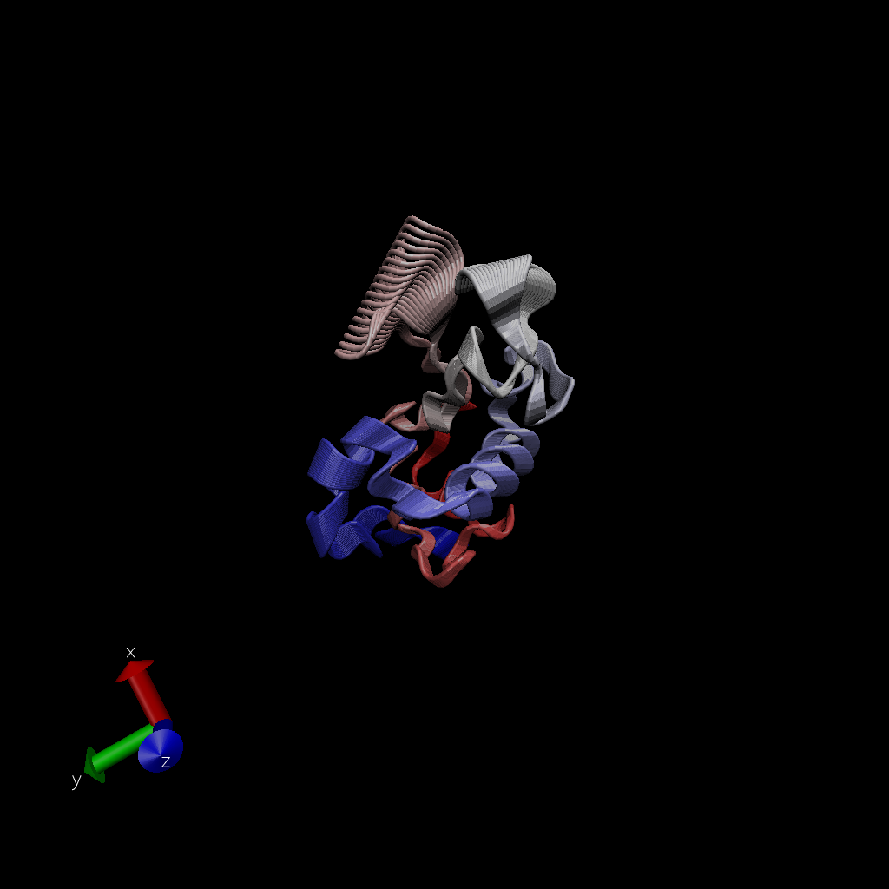
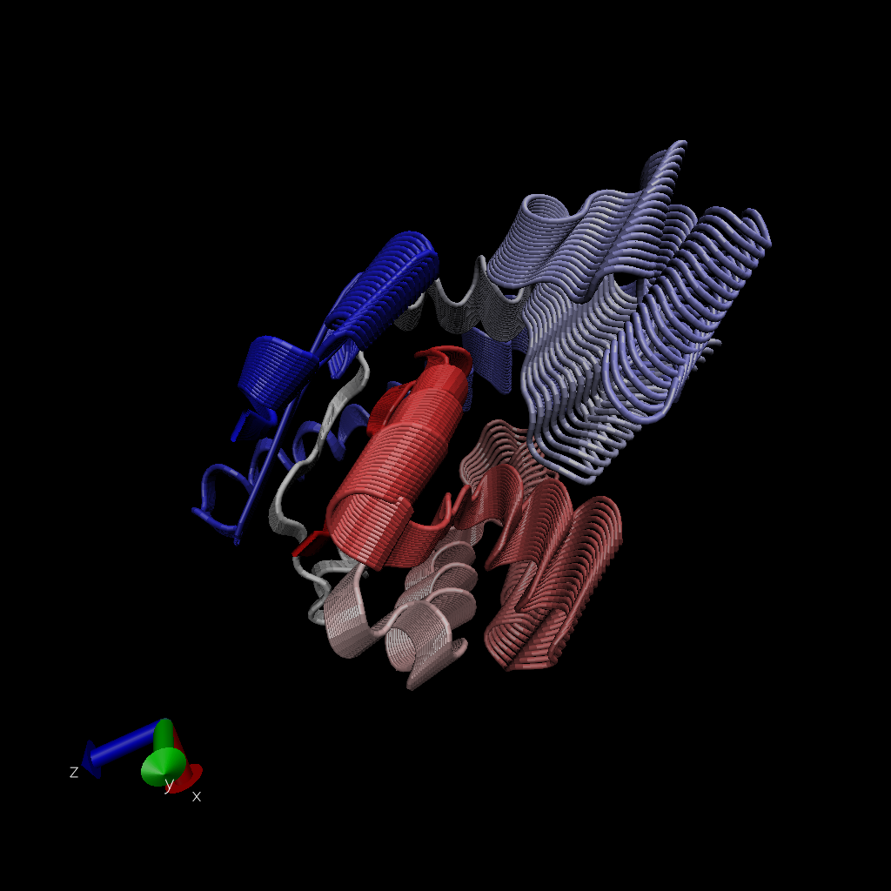

# Comparative analysis of protein structures

Using the bio3d package.

```{r}
library(bio3d)
pdb <- read.pdb("1hel")
pdb
```

Let's use a bioinformatics method called NMA (Normal Mode Analysis) to predict the dynamics (flexibility) of this enzyme.

```{r}
modes <- nma(pdb)
plot(modes)
```

Make a "move" of its predicted motion. We often call this a "trajectory".

```{r}
mktrj(modes, file="nma.pdb")
```



```{r}
aa <- get.seq("1ake_A")
aa
```

```{r}
# Run BLAST from R, but it can take a while to do if a lot of students are running BLAST at the same time
blast <- blast.pdb(aa)
hits <- plot(blast)
```

```{r}
hits$pdb.id
```

```{r}
# Download related PDB files
files <- get.pdb(hits$pdb.id, path="pdbs", split=TRUE, gzip=TRUE)
```

Let's do a multiple sequence / structure alignment with the PDB files we just downloaded,

```{r}
# Align related PDBs
pdbs <- pdbaln(files, fit = TRUE)
```

```{r}
# Vector containing PDB codes for figure axis
ids <- basename.pdb(pdbs$id)

# Draw schematic alignment
plot(pdbs, labels=ids)
```

# PCA

We will use the bio3d pca() function which is designed for protein structure data.

```{r}
# Perform PCA
pc.xray <- pca(pdbs)
plot(pc.xray)
```

# Further Visualization 

Make a trajectory visualization of the motion capture.

```{r}
# Visualize first principal component
pc1 <- mktrj(pc.xray, pc=1, file="pc_1.pdb")
```



