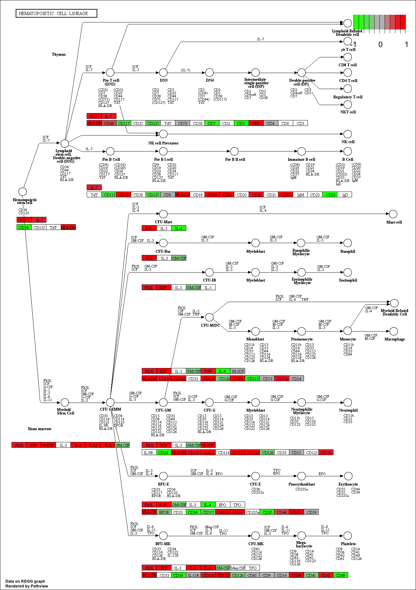
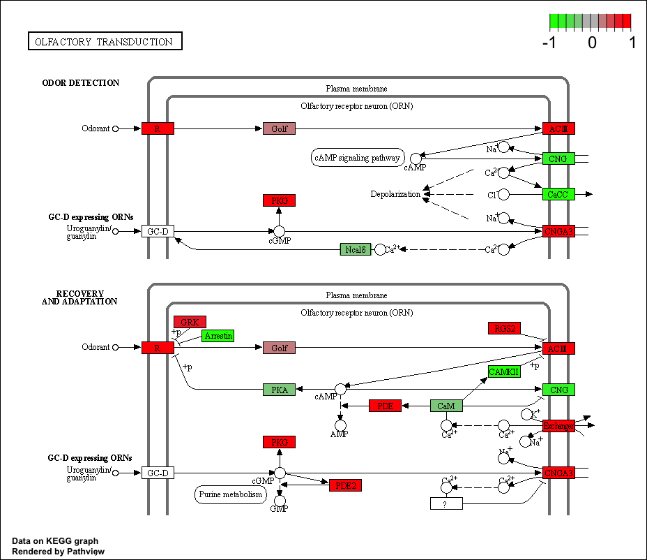
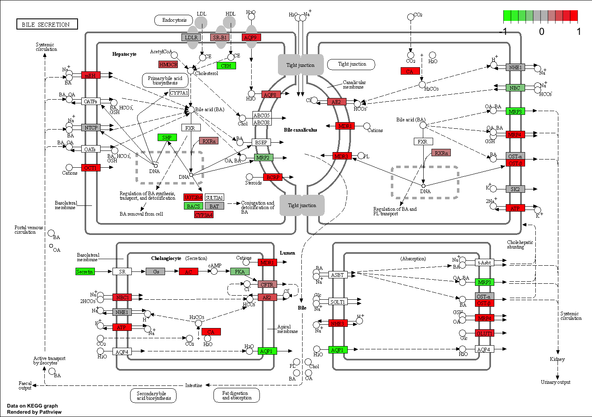

# 1. Differential Expression Analysis

```{r}
metaFile <- "GSE37704_metadata.csv"
countFile <- "GSE37704_featurecounts.csv"

# Import metadata and take a peak
colData = read.csv(metaFile, row.names=1)
head(colData)
```

```{r}
# Import countdata
countData = read.csv(countFile, row.names=1)
head(countData)
```

> Q. Complete the code below to remove the troublesome first column from countData

```{r}
# Note we need to remove the odd first $length col
countData2 <- as.matrix(countData[,-1])
head(countData)
```

This looks better but there are lots of zero entries in there so let's get rid of them as we have no data for these.

> Q. Complete the code below to filter countData to exclude genes (i.e. rows) where we have 0 read count across all samples (i.e. columns).

```{r}
head(countData2)
```

```{r}
countsnozero <- countData2[rowSums(countData2) !=0, ]
head(countsnozero)
```


# 2. DESeq Analysis

```{r}
library(DESeq2)
```


Setup the objcet required by DESeq 

```{r}
dds = DESeqDataSetFromMatrix(countData=countData2,
                             colData=colData,
                             design=~condition)
dds = DESeq(dds)
```

Get our results
```{r}
res <- results(dds)
head(res)
```

```{r}
res = results(dds, contrast=c("condition", "hoxa1_kd", "control_sirna"))
```

> Q. Call the summary() function on your results to get a sense of how many genes are up or down-regulated at the default 0.1 p-value cutoff.

```{r}
summary(res)
```

# 3. Annotation

> Q. Use the mapIDs() function multiple times to add SYMBOL, ENTREZID and GENENAME annotation to our results by completing the code below.

We want to add gene symbols, entrez ID's and gene names. 
```{r}
library("AnnotationDbi")
library("org.Hs.eg.db")

columns(org.Hs.eg.db)

res$symbol <- mapIds(org.Hs.eg.db,
                    keys=row.names(res), 
                    keytype="ENSEMBL",
                    column="SYMBOL",
                    multiVals="first")

res$entrez <- mapIds(org.Hs.eg.db,
                    keys=row.names(res),
                    keytype="ENSEMBL",
                    column="ENTREZID",
                    multiVals="first")

res$name <- mapIds(org.Hs.eg.db,
                    keys=row.names(res),
                    keytype="ENSEMBL",
                    column="GENENAME",
                    multiVals="first")

head(res, 10)
```

# 4. Volcano Plot

```{r}
plot( res$log2FoldChange, -log(res$padj) )
```


> Q. Improve this plot by completing the below code, which adds color and axis labels

```{r}
library(EnhancedVolcano)

x <- as.data.frame(res)

EnhancedVolcano(x,
    lab = x$symbol,
    x = 'log2FoldChange',
    y = 'pvalue')
```


# PCA Plot

```{r}
pca <- prcomp(t(countsnozero))
```

```{r}
mycols <- rep(c("red", "blue"), each=3)
```

```{r}
plot(pca$x[,1:2], col=mycols)
```

# 5. Pathway Analysis

```{r}
library(pathview)
library(gage)
library(gageData)
```

Focus on the signaling subset of KEGG
```{r}
data(kegg.sets.hs)
data(sigmet.idx.hs)

# Focus on signaling and metabolic pathways only
kegg.sets.hs = kegg.sets.hs[sigmet.idx.hs]
```

```{r}
foldchanges = res$log2FoldChange
names(foldchanges) = res$entrez
head(foldchanges)
```

```{r}
keggres <- gage(foldchanges, gsets=kegg.sets.hs)
```

```{r}
pathview(gene.data=foldchanges, pathway.id="hsa04110")
```


```{r}
# A different PDF based output of the same data
pathview(gene.data=foldchanges, pathway.id="hsa04110", kegg.native=FALSE)
```

```{r}
## Focus on top 5 upregulated pathways here for demo purposes only
keggrespathways <- rownames(keggres$greater)[1:5]

# Extract the 8 character long IDs part of each string
keggresids = substr(keggrespathways, start=1, stop=8)
keggresids
```

```{r}
pathview(gene.data=foldchanges, pathway.id=keggresids, species="hsa")
```






# GO

```{r}
data(go.sets.hs)
data(go.subs.hs)

# Focus on Biological Process subset of GO
gobpsets = go.sets.hs[go.subs.hs$BP]

gobpres = gage(foldchanges, gsets=gobpsets, same.dir=TRUE)

lapply(gobpres, head)
```


